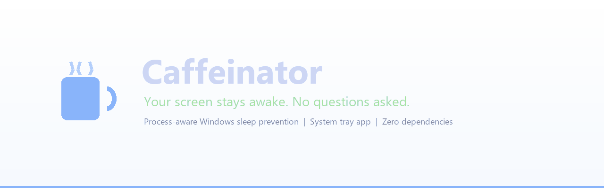
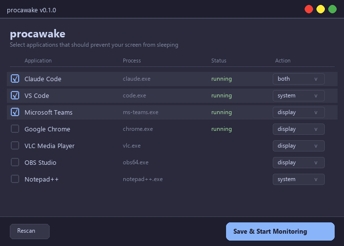

<p align="center">
  
</p>

<p align="center">
  <strong>Your screen stays awake. No questions asked.</strong>
</p>

<p align="center">
  <a href="#-quick-start"></a>
  <a href="https://www.python.org/"></a>
  <a href="LICENSE"></a>
  <a href="https://github.com/Ublaze/Caffeinator/releases"></a>
</p>

---

**Caffeinator** is a Windows app that keeps your screen alive when specific applications are running. Unlike tools that are always-on or use input simulation hacks, Caffeinator monitors your processes and only prevents sleep when apps *you care about* are active.

Built with native Win32 power APIs. Shows up in `powercfg /requests`. No admin rights needed.

<p align="center">
  
</p>

## Why Caffeinator?

| Problem | How others solve it | How Caffeinator solves it |
|---------|-------------------|--------------------------|
| Screen locks during video calls | Always-on "caffeine" toggle | Only active when Teams/Zoom is running |
| Display sleeps during long builds | Fake keyboard input every 60s | Detects `cargo.exe` / `node.exe` CPU usage |
| Need different rules for different apps | One global setting | Per-app rules: display, system, or both |
| Forgot to turn it off | Manual toggle | Automatic — stops when your app closes |

## Features

- **Per-app rules** — choose exactly which apps keep your screen alive
- **Settings GUI** — scan running apps, check the ones you want, done
- **Modern Win32 API** — uses `PowerCreateRequest`, visible in `powercfg /requests`
- **System tray** — coffee cup icon changes color based on status
- **Session-aware** — pauses when you lock your screen (no wasted power)
- **Cooldown** — 30s grace period prevents rapid on/off during app restarts
- **Auto-detect** — scans for 35+ common apps (IDEs, media players, meeting tools)
- **Window title matching** — regex rules like "only during Teams *Meetings*"
- **CPU threshold** — trigger only when an app is actually working hard
- **Foreground check** — optionally, only when app has focus
- **Standalone .exe** — no Python, no install, just run it
- **Full CLI** — power users get `procawake add`, `procawake diagnose`, etc.

## Quick Start

### Option 1: Download and run (recommended)

1. Grab `procawake.exe` from [Releases](https://github.com/Ublaze/Caffeinator/releases)
2. Double-click it
3. Select your apps in the settings window
4. Click **Save & Start Monitoring**
5. That's it — Caffeinator lives in your system tray

### Option 2: Install from PyPI

```bash
pip install procawake
procawake
```

### Option 3: Run from source

```bash
git clone https://github.com/Ublaze/Caffeinator.git
cd Caffeinator
pip install -e .
procawake
```

## How It Works

```
  Your apps running          Caffeinator              Windows
  ==================    ==================    ==================

  [VS Code]  ------>    Monitor detects     -->  PowerCreateRequest
  [Teams]    ------>    process + rules     -->  (display: ON)
  [VLC]      ------>    match criteria      -->  Screen stays alive

  [App exits] ----->    30s cooldown...     -->  PowerClearRequest
                        Rule deactivated    -->  Normal sleep resumes
```

1. **Monitor** polls running processes every 5 seconds (configurable)
2. For each enabled rule, checks: process running? + title match? + CPU above threshold?
3. When matched, creates a native Win32 power request
4. When the app exits, waits 30s cooldown, then releases the request
5. On session lock, display requests pause automatically

## Settings GUI

On first launch, Caffeinator opens a settings window that:

- Scans all currently running applications
- Shows them with checkboxes and action dropdowns
- Lets you pick **display** (screen stays on), **system** (prevent sleep), or **both**
- Saves your choices — next launch goes straight to the system tray

Reopen anytime by right-clicking the tray icon and selecting **Settings...**

## CLI (for power users)

The GUI is the primary interface, but everything is also available from the command line:

```
procawake run              Start the tray application (default)
procawake status           Show current status and power requests
procawake scan             Auto-detect applications
procawake list             List all configured rules
procawake add <proc.exe>   Add a monitoring rule
procawake remove <name>    Remove a rule by name
procawake enable <name>    Enable a rule
procawake disable <name>   Disable a rule
procawake diagnose         Show power diagnostics (powercfg /requests)
procawake config --edit    Open config in default editor
```

### CLI Examples

```bash
# Add VS Code — keep system awake (allow display to sleep)
procawake add code.exe --name "VS Code" --action system

# Add Teams — keep display on only during meetings
procawake add ms-teams.exe --name "Teams Meeting" --action display --window-title ".*Meeting.*"

# Add a build tool — only when CPU is active
procawake add cargo.exe --name "Rust Build" --action system --cpu-above 5.0

# Check what Windows thinks is preventing sleep
procawake diagnose
```

## Configuration

Config is stored at `%APPDATA%\procawake\config.toml` and managed through the GUI. Power users can edit it directly:

```toml
version = 1

[global]
poll_interval = 5          # seconds between process checks
cooldown = 30              # seconds to wait after app exits
start_minimized = true
run_at_login = false
log_level = "INFO"

[[rules]]
name = "VS Code"
process = "code.exe"
action = "system"
enabled = true

[[rules]]
name = "Teams Meeting"
process = "ms-teams.exe"
window_title = ".*Meeting.*"
action = "display"
enabled = true
```

### Rule Options

| Field | Type | Default | Description |
|-------|------|---------|-------------|
| `name` | string | *required* | Display name |
| `process` | string | *required* | Process name (e.g., `code.exe`) |
| `action` | string | `"both"` | `display`, `system`, or `both` |
| `enabled` | bool | `true` | Toggle without deleting |
| `window_title` | string | | Regex to match window titles |
| `cpu_above` | float | `0.0` | CPU% threshold to trigger |
| `cooldown` | int | *(global)* | Per-rule cooldown override |
| `require_foreground` | bool | `false` | Only when app has focus |

## Comparison

| Feature | Caffeinator | PowerToys Awake | Caffeine | Don't Sleep |
|---------|:-----------:|:---------------:|:--------:|:-----------:|
| Per-app rules | Yes | - | - | - |
| Settings GUI | Yes | Yes | - | Yes |
| Window title matching | Yes | - | - | - |
| CPU threshold | Yes | - | - | - |
| Modern Power API | Yes | Yes | - | - |
| Shows in powercfg | Yes | Yes | - | - |
| System tray | Yes | Yes | Yes | Yes |
| CLI | Yes | Partial | - | - |
| Session-aware | Yes | - | - | - |
| Standalone exe | Yes | Yes | Yes | Yes |
| No input simulation | Yes | Yes | - | - |
| Open source | MIT | MIT | - | - |

## System Requirements

- **Windows 10 or 11** (64-bit)
- That's it. The standalone `.exe` bundles everything.

For development: Python 3.11+

## Building from Source

```bash
# Install dependencies
pip install -e .

# Run tests
pytest tests/ -v

# Build standalone exe
pip install pyinstaller
python scripts/build.py

# Build exe + Windows installer (requires Inno Setup)
python scripts/build.py --installer
```

## Architecture

```
CLI (cli.py)         App (app.py)         Tray (tray.py)
     |                    |                    |
     +-----> Config <-----+----> GUI <---------+
             (TOML)       |    (tkinter)
                          |
              +-----------+-----------+
              |                       |
          Monitor                   Power
        (psutil +                (Win32 API)
        EnumWindows)       PowerCreateRequest
                          SetThreadExecutionState
```

- **Main thread**: System tray (pystray)
- **Background thread**: Process monitor (5s polling)
- **On-demand**: Settings GUI (tkinter)

## Contributing

Issues and PRs are welcome. Please:

1. Fork the repo
2. Create a feature branch
3. Run `pytest` before submitting
4. Keep changes focused

## License

[MIT](LICENSE) — use it however you want.
